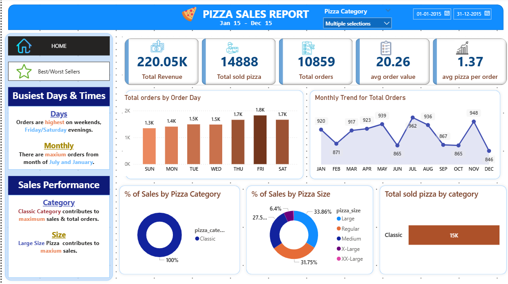

</img>

# 🍕 Pizza Sales Analysis Dashboard

This repository contains a complete data analysis pipeline for pizza sales, including data cleaning and transformation using PostgreSQL, followed by interactive visualizations built in Power BI.

## 📊 Project Overview

The goal of this project is to uncover insights from pizza sales data to help improve business performance. It covers:

- Data cleaning and preprocessing in PostgreSQL
- Exploratory data analysis (EDA)
- KPI tracking and trend visualization in Power BI

## 🧰 Tools & Technologies

- **PostgreSQL** – for data storage, cleaning, and querying
- **Power BI** – for dashboard creation and data visualization
- **GitHub** – for version control and collaboration

## 📁 Repository Structure


pizza-sales-analysis/ 

├── pizza_sales.csv                  # data files

├── analysis_queries.sql             # SQL scripts for analysis 

├── sales_dashboard                 # Power BI (.pbix) file 

├── pizza_images/                   # Dashboard screenshots for preview 

└── README.md                      # Project documentation

## 🧪 Data Cleaning & Analysis

Performed in PostgreSQL:
- Removed duplicates and nulls
- Standardized column formats
- Created calculated fields (e.g., revenue, profit margin)
- Aggregated data by time, category, and location

## 📈 Power BI Dashboard Highlights

Key features of the dashboard:
- Total sales and revenue trends
- Best-selling pizza categories and sizes
- Sales performance by day of week and time of day
- Interactive filters for date range and pizza type



## 🚀 How to Run

1. Clone the repository:
   ```bash
   git clone https://github.com/sonalipatil2911/pizza_sales_analysis.git


- Load the SQL scripts into your PostgreSQL database
- Open the Power BI file (.pbix) and connect to your database
📌 Future Improvements- Add predictive analytics using Python or R
- Integrate real-time data updates
- Deploy dashboard to Power BI Service for sharing
📬 Contact For questions or collaboration, feel free to reach out:- GitHub: sonalipatil2911
- Email: sonalipatil2911@gmail.com

